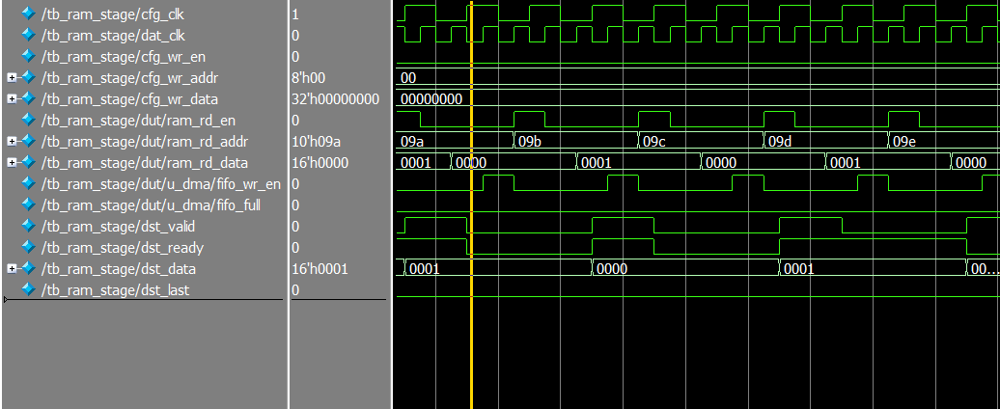
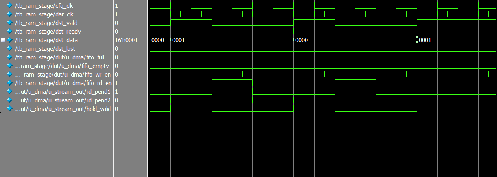
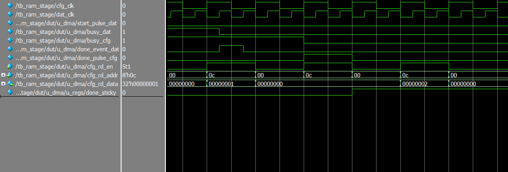

# Register Controlled DMA Stream Engine (SystemVerilog)

## Overview
This project implements a small register controlled DMA read engine in SystemVerilog. The DMA reads data from a memory mapped RAM in one clock domain, buffers it through an asynchronous FIFO, and streams the data out in a separate clock domain using a `valid/ready` style interface.

The design is split across configuration, data, and clock domain crossing modules, with both simulation and FPGA self test.

## Features
- Register programmable source address and transfer length
- Independent configuration and data clock domains
- Command CDC from configuration domain to data domain
- Status/event CDC from data domain back to configuration domain
- RAM read controller with transfer completion tracking
- Asynchronous FIFO buffering between domains
- Streaming output with `valid`, `data`, `last`, and `ready`
- Sticky status bits and optional interrupt on completion
- Simulation testbench with scoreboard style checking
- FPGA selftest wrapper using LFSR based pattern generation/checking

## Files

### Core RTL
- `rtl/dma_core.sv` — top level DMA core integrating registers, CDC, controller, FIFO, and stream output
- `rtl/dma_regs.sv` — configuration/status register block
- `rtl/dma_cmd_cdc.sv` — command transfer from `cfg_clk` to `dat_clk`
- `rtl/dma_ctrl_dat.sv` — data side RAM read controller
- `rtl/dma_status_cdc.sv` — status/event transfer from `dat_clk` to `cfg_clk`
- `rtl/dma_stream_out.sv` — stream interface logic on the configuration clock side
- `rtl/async_fifo.sv` — asynchronous FIFO used for clock domain crossing
- `rtl/ram_stage.sv` — wrapper combining the DMA core with dual-port RAM for simulation/integration

### Simulation
- `sim/tb_ram_stage.sv` — testbench covering basic transfer, backpressure, and zero length behavior

### FPGA / hardware validation
- `fpga/dma_selftest.sv` — built in selftest engine that initializes RAM and checks streamed data
- `fpga/fpga_top.sv` — top level FPGA integration wrapper

### IP
- `ip/ram_dual.qip` — Quartus integration file for dual-port RAM IP
- `ip/ram_dual.v` — generated dual-port RAM module
- `ip/pll_100MHz.qip` — Quartus integration file for PLL IP
- `ip/pll_100MHz.v` — generated PLL module

## Architecture

### Top level data flow
1. Software or test logic writes DMA configuration registers in the `cfg_clk` domain.
2. A start command is transferred into the `dat_clk` domain through `dma_cmd_cdc`.
3. `dma_ctrl_dat` issues RAM reads and packages each output word with a `last` flag.
4. The combined `{last, data}` word is written into an asynchronous FIFO.
5. `dma_stream_out` reads the FIFO from the `cfg_clk` domain and drives the destination stream interface.
6. Completion and overflow events are transferred back into the configuration domain through `dma_status_cdc`.

### Configuration interface
The DMA exposes a simple configuration interface with write/read strobes, byte addresses, and 32-bit register data.

Register map:
- `0x00` — source address
- `0x04` — transfer length
- `0x08` — control
- `0x0C` — status

Control register:
- bit 0 — start (write 1 to start)
- bit 1 — interrupt enable

Status register:
- bit 0 — busy
- bit 1 — done sticky
- bit 2 — error sticky
- bit 3 — FIFO overflow sticky
- bit 4 — destination stall sticky

## Design Notes

### Clock domain crossing
The design uses separate mechanisms for level and event crossing:
- command start is transferred using a toggle based CDC path
- status events are returned using toggle based event synchronization
- FIFO data crosses domains through an asynchronous FIFO using synchronized Gray pointers

### RAM read pipeline
The data side controller assumes a fixed read latency from the RAM interface and aligns the `last` flag with the returned data before pushing into the FIFO.

### Stream output behavior
The FIFO is not show ahead, so `dma_stream_out` uses an internal pending/readcapture pipeline to account for the registered FIFO output timing.

### Interrupt behavior
`irq` is asserted when interrupt enable is set and the done sticky bit is latched.

## Verification

### Simulation testbench
The included testbench instantiates `ram_stage.sv` and verifies the DMA in a realistic integrated configuration.

Covered scenarios:
- basic transfer with programmed source address and length
- randomized backpressure on the destination stream
- zero length transfer behavior

The testbench:
- writes known patterns into RAM through the write port
- programs DMA registers through the configuration interface
- checks stream output ordering and `last` flag behavior
- polls completion status
- stops on mismatch using `$fatal`

## Example Waveforms

### Basic DMA transfer
This waveform shows a programmed transfer moving data from RAM in the `dat_clk` domain into the asynchronous FIFO and out through the destination stream in the `cfg_clk` domain.

### Backpressure handling
This waveform shows the destination stream under backpressure. The DMA continues buffering through the asynchronous FIFO while `dst_ready` is intermittently deasserted. 

### Completion and status signaling
This waveform shows transfer completion and the return of status into the configuration domain, including the sticky done indication.

### FPGA self test
The FPGA self test wrapper:
- fills RAM with an LFSR generated pattern
- programs the DMA through the config interface
- receives stream output and compares it against the expected LFSR sequence
- optionally applies randomized backpressure
- latches pass/fail and mismatch status

This allows hardware validation of the integrated design without requiring an external host.

## Assumptions and Constraints
- RAM read timing is assumed by the data side controller and should match the instantiated memory behavior
- the asynchronous FIFO is required for crossing from `dat_clk` to `cfg_clk`
- destination stream timing assumes handshake with `dst_valid` / `dst_ready`
- the FPGA integration files are included as a hardware validation aid, not as a board specific deployment package

